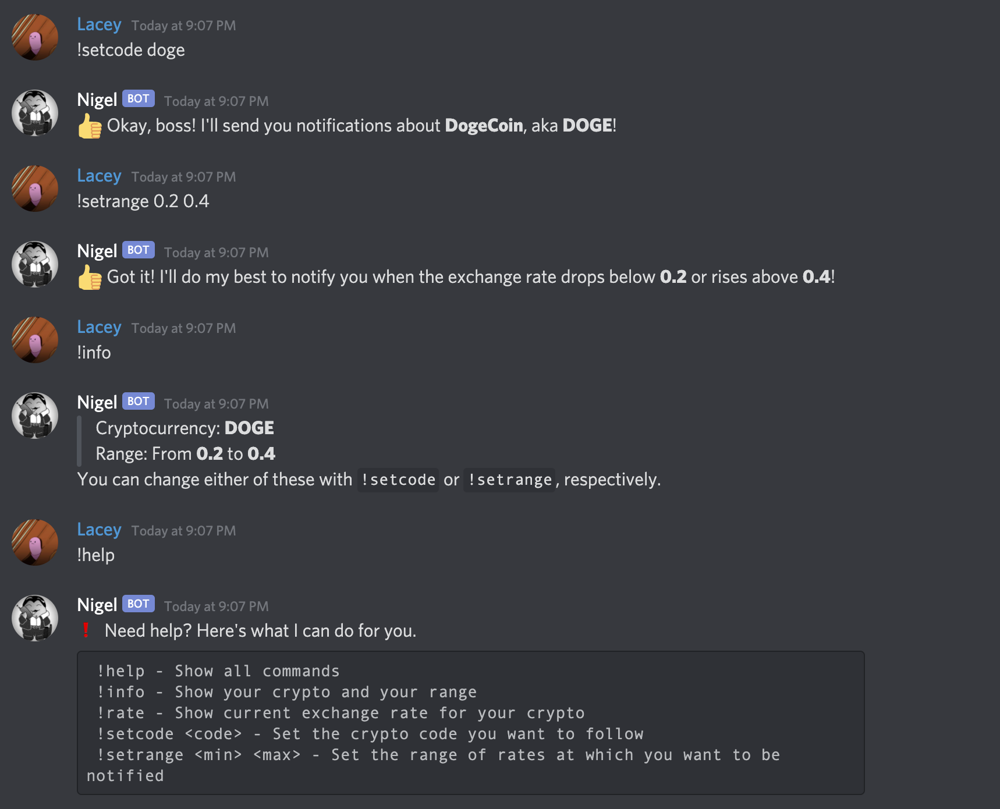

# Crypto Discord Bot (Nigel)

## About
Nigel is a Discord bot that will keep you up-to-date on the exchange rates (in USD) for any cryptocurrency. 

Built with Python and the Alpha Vantage API. Hosted on Replit.

### Features
* Updates its status every 5 minutes to include the current exchange rate
* Notifies you whenever the current exchange rate is above or below user-specified thresholds

Due to API limitations (500 requests/day), the bot can only keep track of one cryptocurrency.

**Fun fact:** I decided to name the bot Nigel, after the humble stockbroker from Neopets. The site was a big part of my childhood, and it was my first exposure to how the stock market works.

## Getting Started
After adding the bot to your Discord server:
1. Type `!setcode <code>` to set the cryptocurrency you want to follow. The code should be the 3 or 4 letter symbol (i.e. DOGE, BTC).
2. Type `!setrange <min> <max>` to set the minimum rate and maximum rate at which you want to be notified. If the exchange rate drops below the min or rises above the max, the bot will send a message.

## Commands
| Command       | Parameters        |  Description    |
| ------------- | ----------------- | --------------- |
| **!help**     |                   | Show all commands
| **!info**     |                   | Show your crypto and your range
| **!rate**     |                   | Show current exchange rate for your
| **!setcode**  | `<code>`          | Set the crypto code you want to
| **!setrange** | `<min> <max>`     | Set the range of rates at which you want to be notified

## In Action

